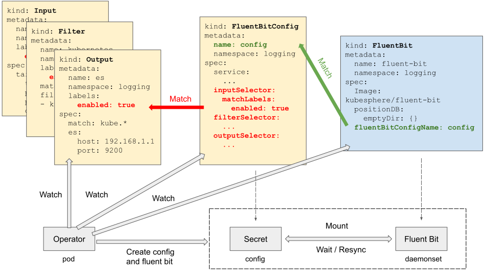

# Fluent Bit Operator

The Fluent Bit Operator for Kubernetes facilitates the deployment of Fluent Bit and provides great flexibility in building logging layer based on Fluent Bit. 

> Note that the operator works with [kubesphere/fluent-bit](https://github.com/kubesphere/fluent-bit), a fork of [fluent/fluent-bit](https://github.com/fluent/fluent-bit). Due to the known [issue](https://github.com/fluent/fluent-bit/issues/365), the original Fluent Bit doesn't support dynamic configuration. To address that, kubesphere/fluent-bit incorporates a configuration reloader into the original. See [kubesphere/fluent-bit](https://github.com/kubesphere/fluent-bit) documentation for more information.     

Once installed, the Fluent Bit Operator provides the following features:

- **Fluent Bit Management**: Deploy and destroy Fluent Bit daemonset automatically.
- **Custom Configuration**: Select input/filter/output plugins via labels.
- **Dynamic Reloading**: Update configuration without rebooting Fluent Bit pods.

## Table of contents

- [Overview](#overview)
- [Get Started](#get-started)
  - [Prerequisites](#prerequisites)
  - [Quick Start](#quick-start)
  - [Logging Stack](#logging-stack)
- [API Doc](#api-doc)
- [Best Practice](#best-practice)
  - [Plugin Grouping](#plugin-grouping)
  - [Path Convention](#path-convention)
- [Features In Plan](#features-in-plan)
- [Development](#development)
  - [Prerequisites](#prerequisites-1)
  - [Running](#running)
- [Contributing](#contributing)
  - [Documentation](#documentation)
  - [Manifests](#manifests)  
  
## Overview

Fluent Bit Operator defines five custom resources using CustomResourceDefinition (CRD):

- **`FluentBit`**: Defines Fluent Bit instances and its associated config. (It requires to work with kubesphere/fluent-bit for dynamic configuration.)
- **`FluentBitConfig`**: Select input/filter/output plugins and generates the final config into a Secret.
- **`Input`**: Defines input config sections.
- **`Filter`**: Defines filter config sections. 
- **`Output`**: Defines output config sections.

Each **`Input`**, **`Filter`**, **`Output`** represents a Fluent Bit config section, which are selected by **`FluentBitConfig`** via label selectors. The operator watches those objects, make the final config data and creates a Secret for store, which will be mounted onto Fluent Bit instances owned by **`FluentBit`**. The whole workflow can be illustrated as below:



## Get Started

### Prerequisites

Kubernetes v1.11.3+ is necessary for running Fluent Bit Operator, while it is always recommended to operate with the latest version. 

If you are using Fluent Bit Operator v0.1.0, remove them alongside CRDs before start. **This is true for KubeSphere v2.x users**. Since the whole project has been completely refactored, old CRDs may cause conflicts. Backup your old CRDs if necessary. **KubeSphere v2.x users can run the following commands to clean legacy**:

```shell
kubectl get fluentbits.logging.kubesphere.io -n kubesphere-logging-system fluent-bit -oyaml > fluent-bit-crd-backup.yaml
kubectl delete deploy -n kubesphere-logging-system logging-fluentbit-operator
kubectl delete fluentbits.logging.kubesphere.io -n kubesphere-logging-system fluent-bit
kubectl delete ds -n kubesphere-logging-system fluent-bit
kubectl delete crd fluentbits.logging.kubesphere.io
```

### Quick Start

The quick start instructs you to deploy fluent bit with dummy as input and stdout as output, which is equivalent to execute the binary with `fluent-bit -i dummy -o stdout`. 

```shell
kubectl apply -f manifests/setup
kubectl apply -f manifests/quick-start
```

Once everything is up, you'll observe messages in fluent bit pod logs like below:

```shell
[0] my_dummy: [1587991566.000091658, {"message"=>"dummy"}]
[1] my_dummy: [1587991567.000061572, {"message"=>"dummy"}]
[2] my_dummy: [1587991568.000056842, {"message"=>"dummy"}]
[3] my_dummy: [1587991569.000896217, {"message"=>"dummy"}]
[0] my_dummy: [1587991570.000172328, {"message"=>"dummy"}]
```

Success!

### Logging Stack

This guide provisions logging pipeline for your work environment. It installs Fluent Bit as daemonset for collecting container logs, filtering unneeded fields and forwarding them to the target destinations (eg. es, kafka, fluentd).


Note that you need a running elasticsearch v5+ to receive data before start. **Remember to adjust [output-elasticsearch.yaml](manifests/logging-stack/output-elasticsearch.yaml) to your es setup**. Otherwise fluent bit will spam errors. Kafka and Fluentd are optional and switched off by default.

```shell
kubectl apply -f manifests/setup
kubectl apply -f manifests/logging-stack
```

Within a couple of minutes, you should observe an index available:

```shell
$ curl localhost:9200/_cat/indices
green open ks-logstash-log-2020.04.26 uwQuoO90TwyigqYRW7MDYQ 1 1  99937 0  31.2mb  31.2mb
``` 

Success!

## API Doc

The listing below shows supported plugins currently. It is based on Fluent Bit v1.5.0. For more information, see API docs of each plugin.

- [Input](docs/crd.md#input)
    - [dummy](docs/plugins/input/dummy.md)
    - [tail](docs/plugins/input/tail.md)
- [Filter](docs/crd.md#filter)
    - [kubernetes](docs/plugins/filter/kubernetes.md)
    - [modify](docs/plugins/filter/modify.md)
    - [nest](docs/plugins/filter/nest.md) 
    - [parser](docs/plugins/filter/parser.md)
    - [grep](docs/plugins/filter/grep.md)
    - [record modifier](docs/plugins/filter/recordmodifier.md)
- [Output](docs/crd.md#output)
    - [elasticsearch](docs/plugins/output/elasticsearch.md)
    - [forward](docs/plugins/output/forward.md)
    - [kafka](docs/plugins/output/kafka.md)
    - [null](docs/plugins/output/null.md)
    - [stdout](docs/plugins/output/stdout.md)

## Best Practice

### Plugin Grouping

Input, filter and output plugins are connected by the mechanism of tagging and matching. For input and output plugins, always create `Input` or `Output` instances for every plugin. Don't aggregate multiple inputs or outputs into one `Input` or `Output` object, except you have a good reason to do so. Take the demo logging stack for example, we have independent yaml files for each kind of outputs.

However, for filter plugins, if you want a filter chain, order of filters matters. You need organize multiple filters into an array as the demo [logging stack](manifests/logging-stack/filter-kubernetes.yaml) suggests.

### Path Convention

Path to file in Fluent Bit config should be well regulated. Fluent Bit Operator adopts the following convention internally.

|Dir Path|Description|
|---|---|
|/fluent-bit/tail|Stores tail related files, eg. file tracking db. Using [fluentbit.spec.positionDB](docs/crd.md#fluentbitspec) will mount a file `pos.db` under this dir by default.|
|/fluent-bit/secrets/{secret_name}|Stores secrets, eg. TLS files. Specify secrets to mount in [fluentbit.spec.secrets](docs/crd.md#fluentbitspec), then you have access.|
|/fluent-bit/config|Stores the final config file.|

> Note that ServiceAccount files are mounted at `/var/run/secrets/kubernetes.io/serviceaccount`.

## Features In Plan

- [ ] Support custom parser plugins
- [ ] Support custom Input/Filter/Output plugins
- [ ] Deploy Fluent Bit as deployment
- [ ] Integrate logging sidecar

## Development

### Prerequisites
- golang v1.13+.
- kubectl v1.11.3+.
- kubebuilder v2.3+ (the project is build with v2.3.0)
- Access to a kubernetes cluster v1.11.3+

### Running

1. Remove legacy from v0.1.0 (optional)
2. Install CRDs: `make install`
3. Run: `make run`

## Contributing

### Documentation

[API Doc](docs/crd.md) is generated automatically. To modify it, edit the comment above struct fields, then run `go run cmd/doc-gen/main.go`.

### Manifests

Most yaml files under the folder [manifests/setup](manifests/setup) are derived from [config](config) which is automatically generated. Don't edit them directly, run `make manifests` instead, then replace them properly.